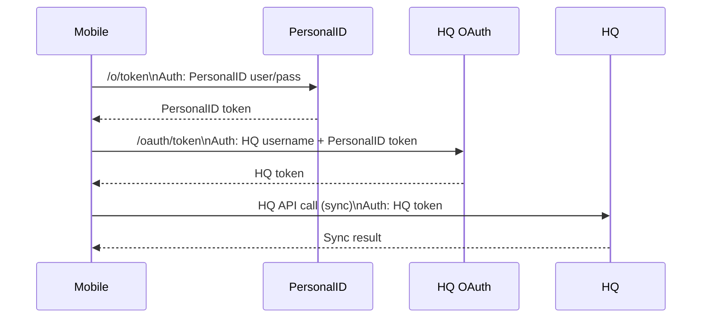

# SSO Token Authentication with PersonalID and Connect

## I. Overview and Core Concepts

* **Terminology and Scope**  
  * SSO: Single Sign-On  
  * Authentication (AuthN): Verifying the user's identity (Primary role of OpenID Connect).  
  * Authorization (AuthZ): Granting access to resources (Primary role of OAuth 2.0).
  * NOTE: ConnectID was the former name for PersonalID (and still the url for that server)
* **Technology Foundations**  
  * **OAuth 2.0:** Protocol for authorization; used to grant access to data (e.g., calendar, contacts) or APIs.  
  * **OpenID Connect (OIDC):** A simpler layer on top of OAuth 2.0 for authentication; the workflow primarily ends at authentication and can include basic user info. It is characterized by requesting `scope=openid`.  
* **System Components (Players)**  
  * **User:** The end user (person)  
  * **CommCare:** The CommCare Android app  
  * **PersonalID:** Auth Tenant (Authorization Server)
  * **HQ OAuth:** HQ auth Tenant (Authorization Server)
  * **HQ:** Any CommCare HQ server (Resource Server)  
  * **Connect:** The CommCare Connect server (Resource Server)  
* **Summary**  
  * PersonalID issues “Connect tokens” to mobile  
  * Mobile sends “Connect tokens” to Connect for authentication  
  * Mobile sends “Connect tokens” to HQ to retrieve “HQ tokens”  
  * Mobile sends “HQ tokens” to HQ for authentication

## II. Authentication Flow

### A. Initial Device Configuration (PersonalID)

* **Purpose:** Establish a user identity and long-term credentials (`CID`, `DB Passphrase`, long-term `password`) for the device.  
* **Key Steps in Workflow (High-Level):**  
  1. Device uses a phone number and Integrity token to identify as the CommCare app.  
  2. Server provides a Configuration Token (Bearer Token Auth).  
  3. User proves control (e.g., Biometric config, Firebase/Twilio OTP verification).  
  4. User provides Name / performs Backup Code verification (Recovery/Registration).  
  5. Server issues final long-term credentials (`CID`, DB Passphrase, API Password).

### B. Standard SSO Token Retrieval and Usage (PersonalID/HQ)

* **Goal:** Mobile needs a valid HQ Token to perform an HQ API call (e.g., sync).  
* **Sequential Workflow Logic:**  
  1. Check local storage for a valid HQ Token. If found, use it.  
  2. If HQ Token is not found or is invalid, check local storage for a valid PersonalID Token.  
  3. If PersonalID Token is found, use it to retrieve a new HQ Token.  
  4. If PersonalID Token is not found or is invalid, retrieve a new PersonalID Token  
  5. If new PersonalID Token is retrieved, store it and use it to retrieve a new HQ Token.  
  6. If the process fails, fallback to `CurrentAuth` (if configured).  
* **API Graph (Token Exchange when no tokens are valid):**  
  1. **Mobile \-\> PersonalID:** Request PersonalID Token (Auth: PersonalID user/pass).  
  2. **Mobile \-\> HQ Key Server:** Request HQ Token (Auth: HQ username \+ PersonalID Token).  
  3. **Mobile \-\> HQ API:** Perform API Call (Auth: HQ Token).

### C. Authentication Methods for Calls

* **Calls During Token Retrieval:** No HTTP Auth is used; credentials/tokens are sent in the request payload.  
  * Requesting PersonalID Token (`grant_type="password"` flow).  
  * Requesting HQ Token (`grant_type="password"` flow where the PersonalID token is the "password").  
* **Calls After Configuration:**  
  * **OAuth calls to PersonalID:** No HTTP Auth, `CID` and long-term `password` in request payload.  
  * **"Usage" calls to PersonalID:** HTTP Basic Auth with user's `CID` and long-term `password`.  
  * **Calls to Connect:** HTTP Bearer Token Auth with OAuth token from PersonalID.  
  * **Calls to HQ:** HTTP Bearer Token Auth with HQ OAuth token.

## III. Implementation Steps and API Specifications

### A. PersonalID Token Request Specification

* **URL:** `connectid.dimagi.com/o/token`  
* **Type:** POST
* **Auth:** NoAuth  
* **Request Payload (Form-Encoded):**  
  * `client_id`: Hard-coded on mobile (identifies the app).  
  * `scope`: `openid`  
  * `grant_type`: `password`  
  * `username`: PersonalID user ID  
  * `password`: PersonalID password  
* **Response Payload:** `access_token` and `expires_in`.

### B. HQ Token Request Specification

* **URL:** `(key server)/oauth/token`  
* **Type:** POST  
* **Auth:** NoAuth  
* **Request Payload (Form-Encoded):**  
  * `client_id`: Hard-coded on mobile (identifies the app).  
  * `scope`: `mobile_access sync`  
  * `grant_type`: `password`  
  * `username`: PersonalID user ID \+ `@` \+ (HQ domain)  
  * `password`: **The PersonalID token** (i.e., the `access_token` from the previous step).  
* **Response Payload:** `access_token` and `expires_in`.

