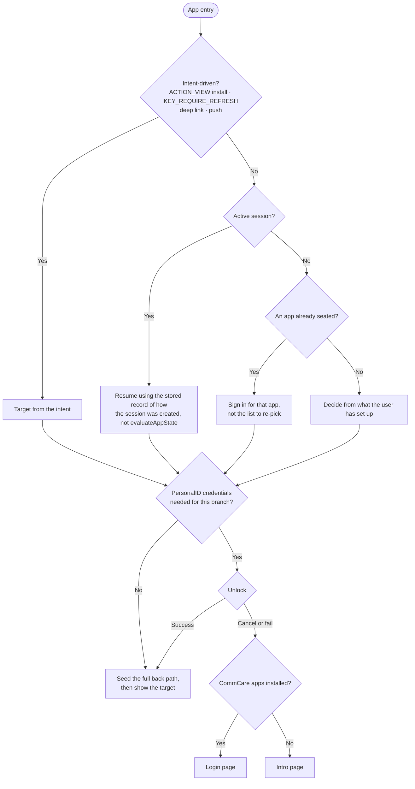

# App Navigation — Technical Spec (Start-of-App Routing & Back Navigation)

> **Important: Read [this tab of the design doc](https://docs.google.com/document/d/1rntc16FW2Jfr6CbzNcZ9RDOxIRrmfcWNU6_d5WL1rA8/edit?tab=t.ongpgraabwyz) first.**
>
> It owns **all user-facing flow charts and visuals.**

**Prerequisite:** the Opportunity Home composition work, which provides the opportunity screen that can run a CommCare app inside itself instead of launching a separate one. The inline silent-login hand-off returns a finished login to that already-open screen; this spec depends on it.

## Scope

**1. `DispatchActivity` becomes a one-time router.** It stays the single startup router — no second routing class — modified to decide **once per cold start** rather than re-evaluating in `onResume`, and to add a Connect-home branch. The decision logic is extracted into a testable pure helper it calls.

**2. Every entry seeds a complete back path.** The sign-in, account and Connect list screens are consolidated into one navigation surface (the "shell"); the CommCare app runtime stays a separately launched screen. Because the path is built before the target is shown, the per-case activity flags that used to force an exit are no longer needed.

## Routing

**Which home an active session resumes to** depends on how that session was created. A session signed in through PersonalID, on an app tied to an opportunity, resumes Opportunity Home; a session signed in with a username and password, or on an app with no opportunity, resumes the CommCare app home.

The unlock gate belongs to the router, so no entry point can bypass it — `ConnectUnlockFragment` stops being the startup host. Entries from inside the app, after the session has already expired, keep today's per-call helpers; north-star collapses both into the one gate.

The fallback screen has to explain why the user is on it. For a PersonalID-assisted user the recovery action there is the PersonalID option, not username/password.

## The seeded back path

| Entry | Task stack, bottom → top |
|---|---|
| Cold start, Connect user with a current opportunity | Opp List → Opp Home |
| Cold start, Connect user with no current opportunity | Opp List |
| Cold start, traditional CommCare or PersonalID user | Login page (CommCare Apps list, once it ships) → app Home |
| Notification into a chat | Opp List → Opp Home → Messaging channel list → Chat |
| Sidebar section opened from inside an opportunity | Opp List → Opp Home → Section |
| A second sidebar section opened after the first | Opp List → Opp Home → New section (the first section is closed) |

The stack therefore never holds more than four screens, and only reaches four when a notification or deep link opens something nested.

A path is built only when there is no real history to retrace: a chat opened from a task on Opportunity Home has history, so Back returns there.

Seeding spans activities, not nav graphs — Messaging is a separate activity with its own `NavHost` and Opportunity Home is in another, so the path is a task stack. `NavDeepLinkBuilder` is not used: it synthesizes only within one graph, and it bypasses the unlock gate.

## The app-bar slot

CommCare screens already route the app-bar arrow to Back, so dropping `Up` requires no change to them.

**Back-swipe** needs no separate rule, but note that on sidebar screens `DrawerLayout` automatically claims the left edge, so a left-edge swipe opens the sidebar while a right-edge swipe goes back.

## Sidebar

**The Connect screens have no sidebar today.** Opportunity List, Opportunity Home, Messaging and Work History all need drawer support added.

## Tabs

The selected Delivery tab is an **argument** to the destination rather than a destination of its own, so a deep link can open a specific tab.

## Session lifecycle

- **Expiry:** Standard Home → CommCare Apps list; Opportunity Home → silent re-login, foreground-visible even when resumed from background. Neither relies on `DispatchActivity` re-dispatch.
- **Forget PersonalID:** already closes the user session — it additionally needs to **re-run the startup router** rather than hardcoding a destination.

## Analytics

- **Which control the user pressed** — app-bar arrow vs. system back. Android does not distinguish a back *gesture* from the back *button* (both arrive through the same callback), so they cannot be reported separately.
- **Why the user was on the Opportunity List** — passing through it on the way out vs. going there deliberately to switch opportunities.

## Interim vs. north-star

- **North-star:** a single `NavHost` shell; the seeded path is the nav back stack.
- **Interim:** the seeded path ships now as a **task stack** on today's activities. This *replaces* rather than coexists with `appLaunchedFromConnect` / `finishAffinity`. `REORDER_TO_FRONT` stays for reusing a running home. `DispatchActivity` stays the single router and continues to own the corrupted-database and recovery paths, plus launches that come from outside the app.

## Testing

- **Router** — a pure function of its inputs, so unit-test every landing outcome, the case where an active session skips the rest of the decision, and the cases where the last-used opportunity has ended or no longer exists.
- **Back navigation** — Robolectric regression tests over the seeded-path table above (assert the stack, not internals), plus two sidebar sections in succession.
- **Startup boundaries** — external `ACTION_VIEW` install, verification refresh, cold-start unlock cancellation with and without apps installed, backgrounded session expiry, and Forget-PersonalID with an active session.
- **Sidebar availability** — assert the app-bar slot per screen, and that it no longer depends on whether the sidebar happens to have been shown before.

---

## Implementation notes (may be skipped when reviewing)

***For the implementer. This adds no reviewer-facing behavior beyond the sections above. Pinned links are to `master` @ `dc7697645`; unpinned `Class:line` references are to `master` @ `aef4da2c0`.***

### Router inputs → source

| Input | Source |
|---|---|
| Active session? (~24h) | [`CommCareApplication.getSession().isActive()`](https://github.com/dimagi/commcare-android/blob/dc7697645fefd99de4e234be569bd8447fb6e0ba/app/src/org/commcare/CommCareApplication.java#L969) |
| Seated-app linkage | [`PersonalIdManager.evaluateAppState`](https://github.com/dimagi/commcare-android/blob/dc7697645fefd99de4e234be569bd8447fb6e0ba/app/src/org/commcare/connect/PersonalIdManager.java#L520) / [`ConnectJobHelper.getJobForSeatedApp`](https://github.com/dimagi/commcare-android/blob/dc7697645fefd99de4e234be569bd8447fb6e0ba/app/src/org/commcare/connect/ConnectJobHelper.kt#L23) |
| PersonalID status | [`PersonalIdManager.isloggedIn()`](https://github.com/dimagi/commcare-android/blob/dc7697645fefd99de4e234be569bd8447fb6e0ba/app/src/org/commcare/connect/PersonalIdManager.java#L149) |
| Connect access + opportunities | [`ConnectUserDatabaseUtil.hasConnectAccess()`](https://github.com/dimagi/commcare-android/blob/dc7697645fefd99de4e234be569bd8447fb6e0ba/app/src/org/commcare/connect/database/ConnectUserDatabaseUtil.java#L44) + opportunity records |
| Installed apps | [`MultipleAppsUtil.usableAppsPresent()`](https://github.com/dimagi/commcare-android/blob/dc7697645fefd99de4e234be569bd8447fb6e0ba/app/src/org/commcare/utils/MultipleAppsUtil.java#L50) |
| Last-accessed opportunity / last session context | new persistence (below) |

### Seeding mechanics

**Interim (task stack).** Build the whole path in one call — `Activity.startActivities(Intent[])`, or `TaskStackBuilder` when the entry point is a notification `PendingIntent` — so the intermediate activities exist before the target is shown. Seed only when the task is being created; an existing task is left alone.

Cost to be aware of: each seeded activity is really created, so a Connect cold start instantiates Opportunity List underneath Opportunity Home. Keep the list's `onCreate` cheap (defer network and heavy binding to `onStart`/`onResume`, which won't run while it is beneath another activity). This cost is interim-only — in the shell, seeding is just pushing nav back-stack entries, with no activity creation.

**Sidebar sections replacing each other.** Launching a section from the drawer finishes the section activity currently on top (if any) before starting the new one, rather than relying on intent flags — `FLAG_ACTIVITY_CLEAR_TOP` clears *ancestors*, not siblings, so it will not pop Messaging when launching Work History. In the shell this becomes `popUpTo(<workspace destination>)` followed by `navigate`, and the depth bound falls out of the graph rather than needing enforcement.

**Explicitly do not** use `NavigationUI`'s default drawer behavior (`popUpTo(startDestination)` + `launchSingleTop`): the sidebar has no "back to my work" item, so popping to the root would leave the user with no route back to the opportunity.

### Slot enforcement

Interim: `BaseDrawerActivity` gains a declared slot per screen (sidebar / back / none) and configures the toggle and `setDisplayHomeAsUpEnabled` from it, replacing the per-activity `onOptionsItemSelected` handling. North-star: `AppBarConfiguration(topLevelDestinationIds)` with `NavigationUI.setupActionBarWithNavController`, listing the sidebar screens as top-level.

### Unlock mechanics

[`PersonalIdUnlocker`](https://github.com/dimagi/commcare-android/blob/dc7697645fefd99de4e234be569bd8447fb6e0ba/app/src/org/commcare/personalId/PersonalIdUnlocker.kt): cancel and failure both resolve through `connectActivityComplete(false)`. `unlock` takes an `UnlockPolicy`; `SESSION_WITH_TIME_THRESHOLD` skips the prompt when unlocked within the last 10 minutes. `lastUnlockTime` is in-memory, so it does not survive process death — a background kill means a fresh prompt.

Helpers that stay in place for sessions that have already expired: `ConnectNavHelper.unlockAndGoToConnectJobsList` / `unlockAndGoToMessaging` / `unlockAndGoToWorkHistory`, called from `BaseDrawerActivity`.

At cold start, show a splash / branded base behind the prompt — Android 12+ `SplashScreen` kept on screen via `setKeepOnScreenCondition`, or a splash-themed `windowBackground`, with `androidx.core:core-splashscreen` for pre-12 — so the biometric/PIN dialog isn't over a blank window.

### Sidebar code changes

- `ConnectActivity` and `ConnectMessagingActivity` extend `NavigationHostCommCareActivity`; `PersonalIdWorkHistoryActivity` extends `CommCareActivity`. None extend `BaseDrawerActivity`, which is why those screens have no drawer. Move all three onto `BaseDrawerActivity` and override `shouldShowDrawer()` to return `true`, since the interim ships on today's activities. The shell absorbs them later, at which point the drawer comes from the shell activity instead.
- Retire `NavDrawerHelper.drawerShownBefore()` / `setDrawerShown()` and the `shouldShowDrawerAfterCheck(requirePersonalIDLogin)` gate. Today `CommCareSetupActivity:315` passes `false` and sets the stored flag, and that stored flag then causes the checks in `LoginActivity:1069` and `StandardHomeActivity:354` to return early without ever testing for PersonalID. `shouldShowDrawer()` defaults to `false`, so only those three activities opt in at present.
- Keep `checkDeviceCompability()` (`SDK_INT >= P`).
- Drawer contents come from `BaseDrawerController.refreshDrawerContent`; the signed-out branch (`setSignedInState(false)` → `configureErrorState()`) renders the sign-up prompt, whose button calls `PersonalIdManager.launchPersonalId(activity, PERSONAL_ID_SIGN_UP_LAUNCH)`.

### Nothing to remove for `Up`

`NavUtils` / `navigateUpFromSameTask` are unused across the app. `CommCareActivity.onOptionsItemSelected:261` routes `android.R.id.home` to `onBackPressed()`. The single `android.support.PARENT_ACTIVITY` entry in the manifest (`ReportProblemActivity`) is inert because nothing calls `navigateUp`. `FormEntryActivity:651` raises the quit prompt from the arrow — leave as-is.

### Tabs

`ConnectDeliveryHomeFragment` hosts the tabs and already accepts the wanted tab as a `TAB_POSITION` argument, defaulting to Dashboard. Deep links just need to set it.

### Persistence

Add to `PersonalIdUserPreferences`, which `forgetUser()` already clears: last-accessed opportunity (`jobUUID`), last session context (`manual` / `PersonalId-non-opportunity` / `PersonalId-on-opportunity-X`), and a per-opportunity terminal-state acknowledgment flag (drives reopen-once-then-fall-back-to-list for ended opportunities).

### Failure fallback — rejected alternative

Do not launch Opportunity Home on top of Login for-result to make the fallback automatic: Back from a *successful* Opportunity Home would then reveal Login and need an exit flag / `finishAffinity` to suppress, reintroducing the per-case flag handling this spec removes.

### Sign-in ordering

Opportunity Home loads first and fires sign-in simultaneously; the Start button and overflow menu stay disabled until sign-in succeeds. The Opportunity Home composition work already gates those actions on whether a session is attached (`areActionsAvailable()`), so no new mechanism is needed.

### Analytics wiring

`FirebaseAnalyticsUtil` with new constants in `CCAnalyticsEvent` / `CCAnalyticsParam`, following the existing `reportX` static pattern. The control-used event fires from the shared slot handling (app-bar arrow) and from the back-pressed path (system back); there is no public API distinguishing gesture from button, so do not add a third value. The Opportunity List event fires when that screen is opened, and the reason comes from how it was opened — placed underneath by the router, or tapped in the sidebar.

### Rotation and process death

Task stacks survive rotation and are restored by the system after process death, so seeded paths need no special handling. The one exception is `lastUnlockTime` above: a resume after process death re-prompts unlock.

### Upgrade

No migration is needed. If the OS restores a task created by the previous version, that task keeps its old stack shape until it is finished; the new model applies from the next task creation.
