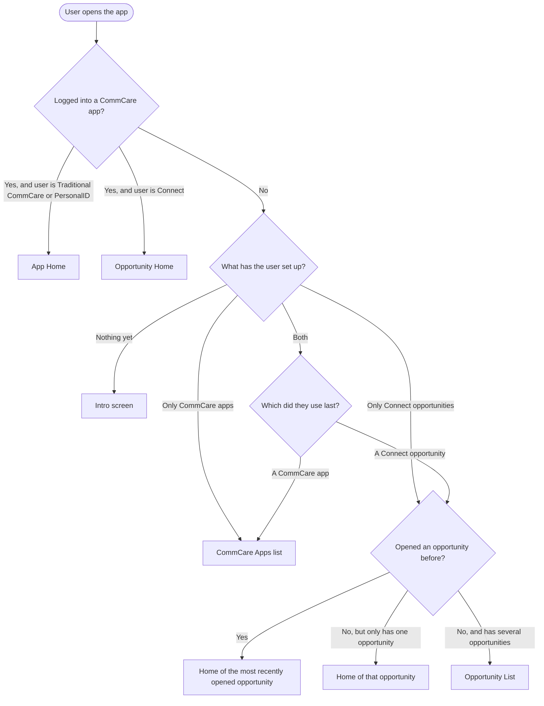
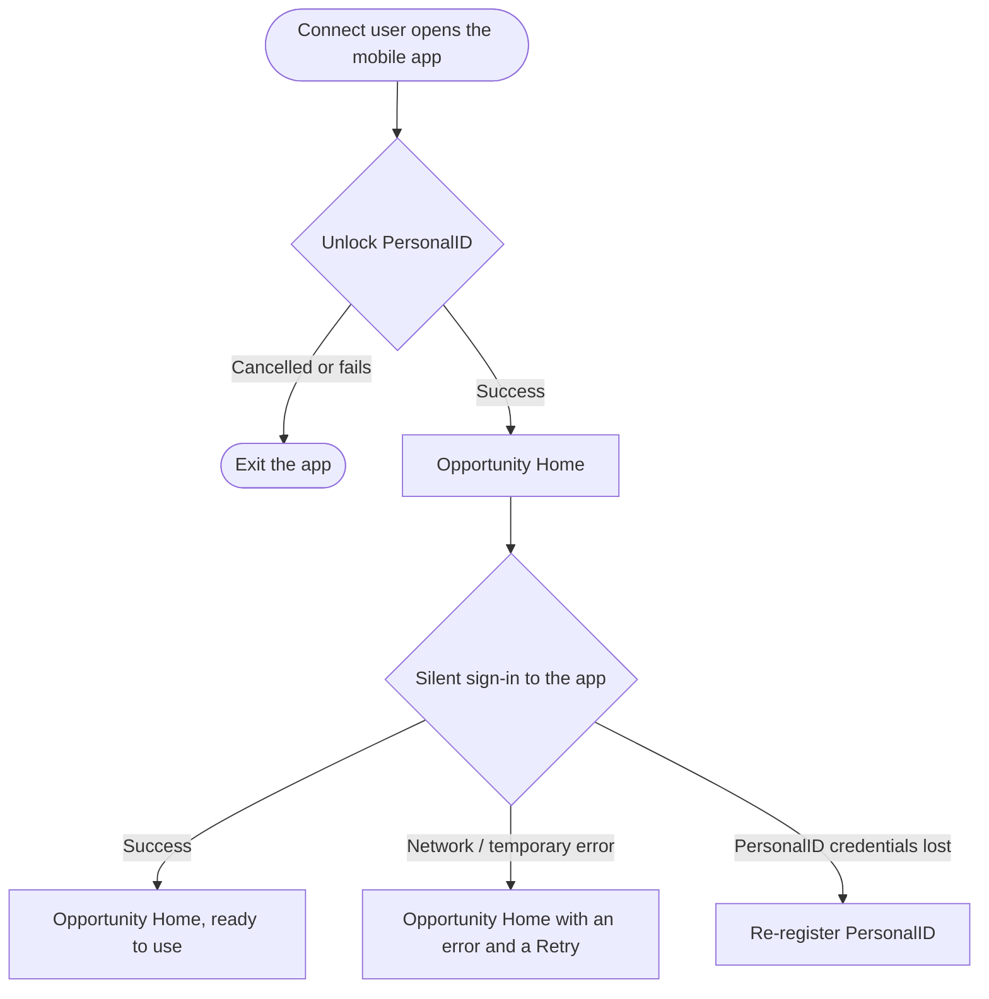
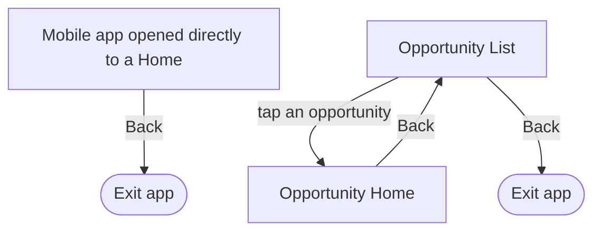
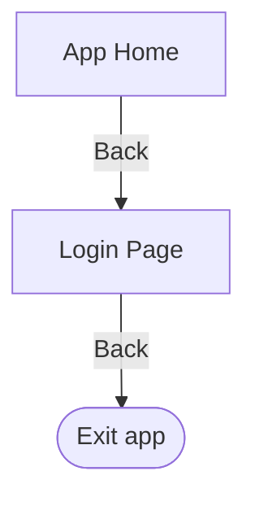

# App Navigation — Technical Spec (Start-of-App Routing & Back Navigation)

> **Important note: Please review [this tab of the design doc](https://docs.google.com/document/d/1rntc16FW2Jfr6CbzNcZ9RDOxIRrmfcWNU6_d5WL1rA8/edit?tab=t.ongpgraabwyz) first.** It defines the target behavior — the user types, where the app opens, how Back behaves, logout, and session timeout — and the product decisions behind them.

**Ticket:** [CCCT-2520](https://dimagi.atlassian.net/browse/CCCT-2520) · **Related:** [PR #3776](https://github.com/dimagi/commcare-android/pull/3776) (Opportunity Home composition), [PR #3765](https://github.com/dimagi/commcare-android/pull/3765) (silent app launch)

The diagrams below are carried over from the design doc for reference.

**Where the app opens**

**When startup fails (Connect)**

**How the Back button behaves**

Back reverses the user's forward steps; the screen the app launched to is the task root, so Back exits from it, and a screen reached by navigating returns to its opener. In-page tabs and drawer section-switches are exceptions that don't retrace — the design doc has the full detail.

**Near-term scope: before the CommCare Apps List exists**

The diagrams above are the target; until the CommCare Apps List ships, the current Login Page is the interim home for traditional and PersonalID users — so at startup the "CommCare Apps list" landing becomes the Login Page. Back follows the same rule: it exits directly when App Home was the launch screen, and retraces to the Login Page when the user logged in there (below).

## Why today's navigation can't deliver this

- `DispatchActivity` (the app's launcher) re-runs its routing every time it returns to the foreground, so backing into it re-dispatches and loops.
- It only ever decides *login vs. CommCare home* — there is no first-class path to a Connect home.
- Navigation is spread across four activities (`DispatchActivity` / `LoginActivity` / `ConnectActivity` / `StandardHomeActivity`), and Back is patched per-case with activity flags. That combination is the direct source of the loops, stale screens, stack growth, and inconsistent exits the team already hit while building the Connect launch flow (#3765).

## The approach

Two changes deliver the target behavior.

**1. A one-time startup router.** A single resolver runs *once* at launch, decides the landing screen, and hands off — taking over the routing role `DispatchActivity` plays today. Running once (instead of on every foreground) is what removes the re-dispatch loop, and it adds the Connect-home branch the current tree lacks. Its outcomes are the "Where the app opens" diagram.

**2. A two-tier structure with stack-based Back.** The identity / Connect / list screens are consolidated into one navigation surface (the "shell"); the CommCare app runtime stays a separately launched screen. Back is then driven by the real screen stack — the screen the app launched to is the task root (Back exits it) and every screen the user navigates to sits above it — so the per-case flags disappear. Connect opportunity screens become app-capable *in place* (via #3776), so opening an opportunity doesn't launch a separate home screen and the stack can't grow. This produces the "How the Back button behaves" diagram.

## Why this covers the tricky cases

The stack-based model resolves the edge cases from [#3765's edge-cases doc](https://docs.google.com/document/d/1jiVEbljnR8abPwJnKzqULTEqbAxU_PAt9sRWkPjTB9k/edit?usp=sharing) without special-casing:

- Backing out of the launch screen exits, because that screen *is* the task root — the same rule whether the user launched there or navigated there (no `appLaunchedFromConnect`-style flag).
- Switching apps, or re-launching a running app, reuses the existing home rather than leaving a stale one to Back into.
- A notification deep-link opens directly to its target, which is then the task root, so Back exits — consistent with every other launch, with no special deep-link back-stack.

## Dependencies

- **[#3776](https://github.com/dimagi/commcare-android/pull/3776) (Opportunity Home composition)** — provides the in-place, app-capable opportunity screen the router lands on. Hard dependency.
- **Inline silent-login hand-off** — parallel work that returns a completed login to the *running* opportunity screen (rather than launching a fresh home). This spec consumes it.
- **Login-page → app-list bottom-sheet redesign** — parallel, not blocking (see the design doc). The router and Back model ship independently; only the specific traditional/PersonalID landing screens depend on it.

## Rollout & testing

Rollout gating, CommCare-division sign-off, and staging are covered in the design doc. Mechanism-wise the change ships [behind a feature flag](https://github.com/dimagi/commcare-android/blob/e1c8ba80ab43114c48d6eda3dd73e5cc724ce194/app/src/org/commcare/personalId/PersonalIdFeatureFlagChecker.kt#L8), dark to `master`, revealed with the redesign.

Testing strategy:

- **Router** — a pure function of its inputs, so it is unit-tested across every landing outcome plus the active-session short-circuit and the terminal/absent last-opportunity cases.
- **Back navigation** — pinned with Robolectric regression tests built from the design doc's flows (assert the stack, not internals).
- **Startup boundaries** — regressions for external `ACTION_VIEW` install, verification refresh, cold-start unlock cancellation, backgrounded session expiry, Forget-PersonalID with an active session, and feature-flag-off behavior for traditional users.

---

## Implementation notes (may be skipped when reviewing the spec)

*For the implementer. This section adds no reviewer-facing behavior beyond the sections above — it records the code-level shape, interim mechanisms, and specific behavioral changes. Code references are pinned to `master` @ `dc7697645`.*

### Startup router

**Discriminator:** how the current session was established — a PersonalID-authenticated session on an opportunity-linked app resumes Opportunity Home; a manual or non-opportunity session resumes the CommCare app home. Verify the live-session signal agrees with `evaluateAppState`.

**Inputs → source:**

| Input | Source |
|---|---|
| Active session? (~24h) | [`CommCareApplication.getSession().isActive()`](https://github.com/dimagi/commcare-android/blob/dc7697645fefd99de4e234be569bd8447fb6e0ba/app/src/org/commcare/CommCareApplication.java#L969) |
| Seated-app linkage | [`PersonalIdManager.evaluateAppState`](https://github.com/dimagi/commcare-android/blob/dc7697645fefd99de4e234be569bd8447fb6e0ba/app/src/org/commcare/connect/PersonalIdManager.java#L520) / [`ConnectJobHelper.getJobForSeatedApp`](https://github.com/dimagi/commcare-android/blob/dc7697645fefd99de4e234be569bd8447fb6e0ba/app/src/org/commcare/connect/ConnectJobHelper.kt#L23) |
| PersonalID status | [`PersonalIdManager.isloggedIn()`](https://github.com/dimagi/commcare-android/blob/dc7697645fefd99de4e234be569bd8447fb6e0ba/app/src/org/commcare/connect/PersonalIdManager.java#L149) |
| Connect access + opportunities | [`ConnectUserDatabaseUtil.hasConnectAccess()`](https://github.com/dimagi/commcare-android/blob/dc7697645fefd99de4e234be569bd8447fb6e0ba/app/src/org/commcare/connect/database/ConnectUserDatabaseUtil.java#L44) + opportunity records |
| Installed apps | [`MultipleAppsUtil.usableAppsPresent()`](https://github.com/dimagi/commcare-android/blob/dc7697645fefd99de4e234be569bd8447fb6e0ba/app/src/org/commcare/utils/MultipleAppsUtil.java#L50) |
| Last-accessed opportunity / last session context | new persistence (below) |

**Precedence:** (1) explicit intent-driven launches first — external `ACTION_VIEW` install (via `CommCareSetupActivity`), `KEY_REQUIRE_REFRESH` verification (via `CommCareVerificationActivity`), deep links, push; (2) active session → resume by the persisted **last session context** (login provenance); tie-break: provenance wins over a stale `evaluateAppState` linkage; (3) no session → resolve by configuration.

**PersonalID unlock** ([`PersonalIdUnlocker`](https://github.com/dimagi/commcare-android/blob/dc7697645fefd99de4e234be569bd8447fb6e0ba/app/src/org/commcare/personalId/PersonalIdUnlocker.kt)): cancel and failure both resolve through `connectActivityComplete(false)`. On a warm entry the prompt dismisses and the underlying screen is unchanged; on a cold start (nothing beneath) it exits the app.

### New persistence

A dedicated shared-preferences store, **scoped to the active PersonalID account** (namespaced per account, cleared on `forgetUser()` / account switch, never inherited): last-accessed opportunity (`jobUUID`), last session context (`manual` / `PersonalId-non-opportunity` / `PersonalId-on-opportunity-X`), and a per-opportunity terminal-state acknowledgment flag (drives the reopen-once-then-fall-back-to-list behavior for ended opportunities).

### Back stack: north-star vs. interim

- **North-star:** a single `NavHost` shell; Back is pure start-destination-exit + synthesized parent stacks; no flags.
- **Interim (Solution A on today's activities):** `ConnectActivity` stays the for-result parent (edge-cases doc's Option D); keep `appLaunchedFromConnect` / `finishAffinity` / `REORDER_TO_FRONT` until the shell lands. `DispatchActivity` remains the manifest launcher for DB-bad-state, recovery, and external/session-endpoint launches; only the landing *decision* moves into the resolver.

### Session lifecycle changes

- **Expiry:** Standard Home → CommCare Apps list; Opportunity Home → silent re-login (#3776), foreground-visible even when resumed from background; neither relies on `DispatchActivity` re-dispatch.
- **Forget PersonalID:** [`forgetUser()`](https://github.com/dimagi/commcare-android/blob/dc7697645fefd99de4e234be569bd8447fb6e0ba/app/src/org/commcare/connect/PersonalIdManager.java#L175) must also `closeUserSession()` before routing to Intro — it does not today, leaving a PersonalID-less session dangling.

### Feature flag

A new flag in [`PersonalIdFeatureFlagChecker`](https://github.com/dimagi/commcare-android/blob/dc7697645fefd99de4e234be569bd8447fb6e0ba/app/src/org/commcare/personalId/PersonalIdFeatureFlagChecker.kt).
